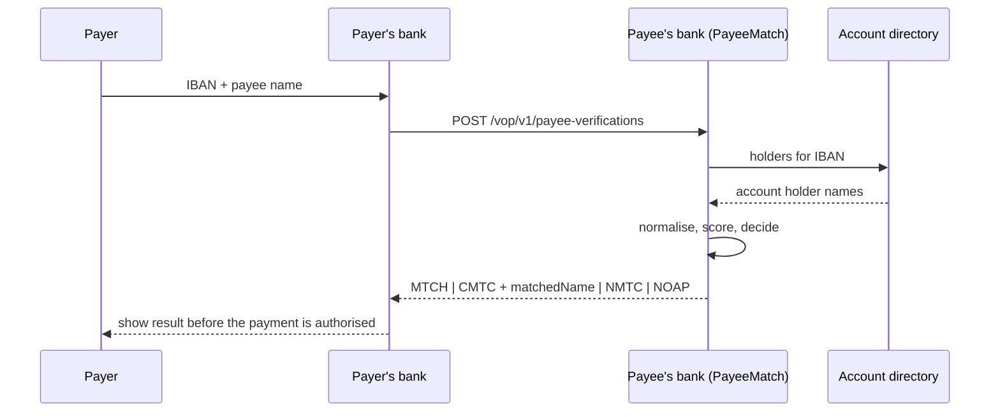

# PayeeMatch

[](https://github.com/softvasco/payee-match/actions/workflows/ci.yml)
[](LICENSE)

Verification of Payee name matching for .NET, following the EPC VOP scheme. You give it the name the payer typed and the account holder names behind an IBAN. It answers match, close match or no match, and tells you why.

Work in progress. The matching core comes first, then the EPC responder API.

## Why

Since 9 October 2025 the EU Instant Payments Regulation requires every payment provider to check the payee name against the IBAN before a credit transfer. The EPC scheme defines the API between banks, but for the matching itself it only gives guidelines. Every bank ended up building or buying its own matcher, and I couldn't find an open one.

The interesting part is the name matching. "Joao M. Silva" and "João Manuel da Silva" should be a close match. "Silva Lda" against "Silva, Unipessoal Lda" probably too. "Silva Construções SA" against "Silva Consultores SA" should not. And a bank has to be able to explain each of those answers to an auditor.

## How a check flows



## Outcomes

| Code | Meaning | Returned name |
|---|---|---|
| MTCH | Match | no |
| CMTC | Close match | yes, the holder's name, so the payer can check |
| NMTC | No match | no |
| NOAP | Check not possible | no |

## Plan

- Name normaliser: diacritics, case, punctuation, titles and legal forms per country.
- Similarity: Jaro-Winkler and Damerau-Levenshtein, plus token rules for word order, initials and missing middle names.
- Decision engine with configurable thresholds and a reason code on every outcome.
- Different rules for people and companies, joint accounts, and LEI checks for the identification code flow.
- ASP.NET Core responder for the EPC endpoint, with an in-memory and a PostgreSQL account directory.
- A public synthetic evaluation set with precision and recall, and benchmarks.

## Build

```bash
dotnet build
dotnet test
```

Needs the .NET 10 SDK.

## License

MIT
